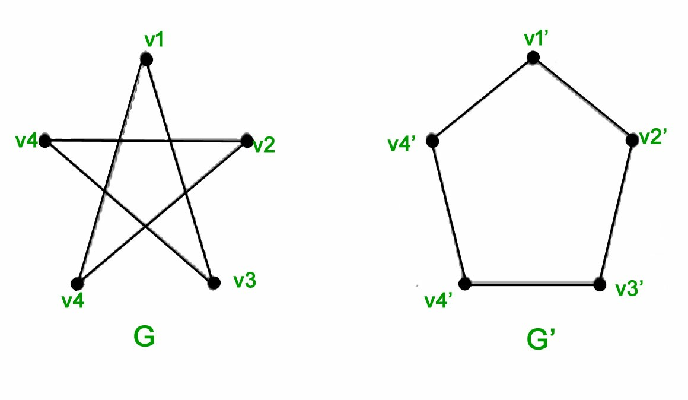
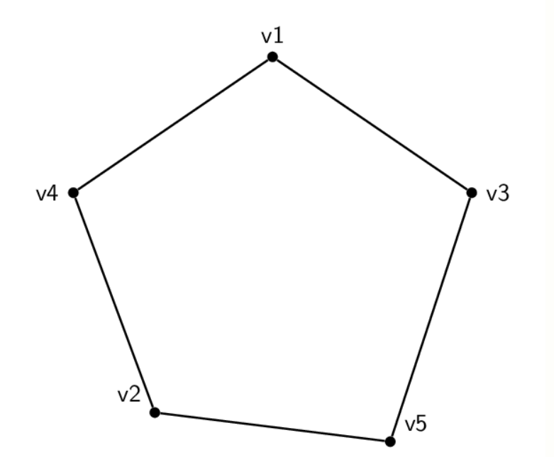
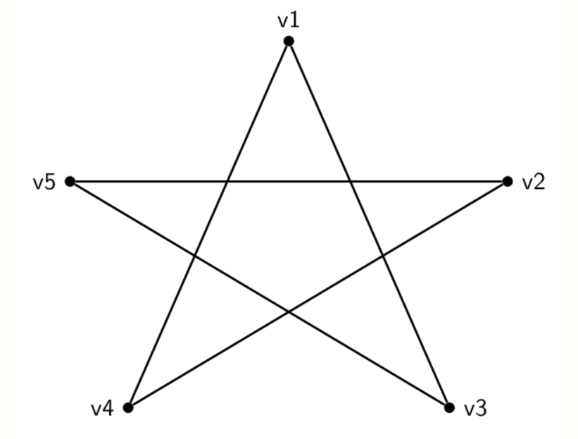
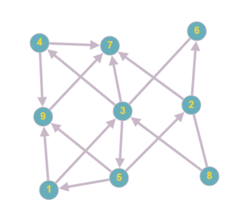
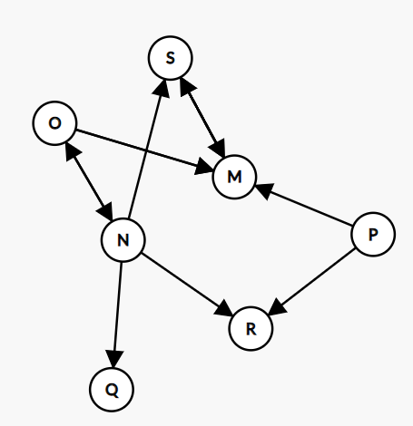
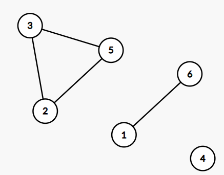
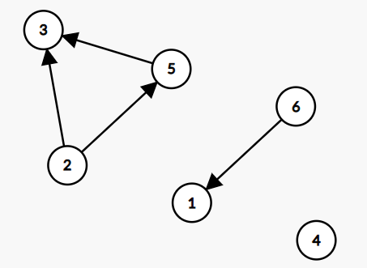
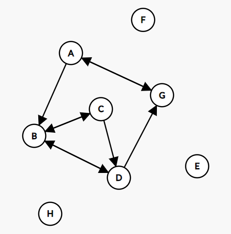
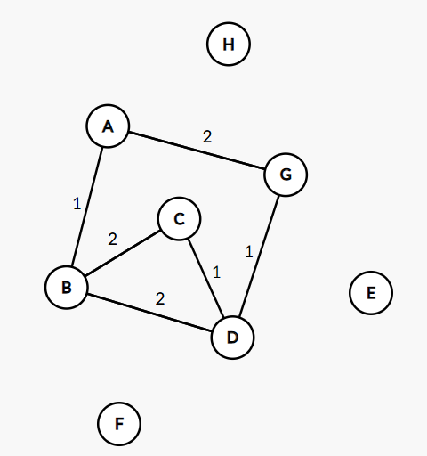

# 1. Define:

	* For all this question, Let G be a graph.

	(a) Subgraph
	
	A subgraph from G is a graph whose vertices and edges are subsets from the sets of vertices and edges of G. That is, a graph is a subgraph if it's a part of another graph.

	(b) Bipartite graph.

	G is said to be a bipartite graph iff its vertices can be divided into two independent and disjointed sets such that no edge in the graph can be found in one single set: it either start from the first set and ends in the second set or starts from the second set and ends in the first set. 
	
	(c) Hamiltonian graph
	
	G is said to be a Hamiltonian graph iff it possesses a Hamiltonian cycle/path/circuit - a path that visits each vertice of the graph exactly once.

	(d) Eulerian graph.

	G is said to be a Eulerian graph iff it possesses a Eulerian cycle/path/circuit - a path that includes all edges exactly once.

# 2. Describe how a breadth-first search algorithm works.

For Breadth-first search algorithm (BFS henceforth), each node/vertice must be known. 

As the name implies, it visits the nodes of the graph by layer, searching "breadth/wide" rather than "deep".

That is, it visits a node (marking it - in this example, A) and all its neighbors (marking them - in this examples, neighbors of A) before moving forward to one of its previously marked neighbors, looking for every single neighbor of the new node, which is the first neighbor of A - it does that until it finds all neighbors of the very first node (A), then it proceedes to do the same to the rest of the neighbors of A, until it eventually goes for the neighbors of neighbors, then their neigbors, until all the graph is searched.

# 3. How many edges does a complete graph with n vertices have? What about a complete directed graph with n vertices?

A complete (undirected) graph is a graph in which each pair of graph vertices is connected by an edge where **order does not matter**, so all edges linking two nodes will count as one and same.

Hence, we can use a binomial coefficient to calculate the number of edges (since each time a vertice links with all "un-edged" vertices, the next vertice is one vertice short, since it was already linked in the previous iteration). 

So, a complete (undirected) graph has C(n,2) = n(n-1)/2 edges.

A complete directed graph is a graph in which each pair of graph vertices is connected by an edge where **order does matter**, so all edges from two nodes will be accounted as different. 

Knowing that, we know that each vertice of the n vertices can link up to every single vertice other than itself, so that makes n-1 edges.

Hence, a complete directed graph has n(n-1) edges.

# 4. What are isomorphic graphs? Draw an example.

Isomorphic graphs are two (or more) graphs that has the same number of vertices, the same number of edges and the same edge connectivity (i.e. the edge connectivity is retained). 

This means that the location of the vertices (and by that, the shape of the graphs) doesn't matter, which leads us to cool stuff, like those two graphs *being isomorphic*:

If it's hard to see the relation between those, try to look below, where the node's names are preserved:

# 5. Calculate the degree of the nodes for both node types in the bipartite adjacency matrix from the figure below. Find the isolated node(s).

The graph for this adjacency matrix is:

* Note that it *is* a digraph; if an edge has no arrow, it goes both ways (e.g nodes 2 and 8 at the far left)

The degree of a node is the number of edges connected to that node; in a directed graph, one must take account of the degrees "ins" and "outs". That being said, the answer will be presented as 

*Node*: *value_degree_in*, *value_degree_out*. 

If you use the matrix, if goes: row = in; line = out.

Here it is:

1: 1, 2 

2: 2, 3

3: 3, 4

4: 1, 2

5: 1, 3

6: 2, 1

7: 4, 0

8: 1, 2

9: 3, 1

Since everyone has at least a edge in one direction, there's no true isolated node in this graph, even though node 7 has no edges pointing outwards.

# 6. Given the digraph `G = (V, E)` where `V = {M, N, O, P, Q, R, S}` and  `E ={(M, S), (N, O), (P, R), (N, S), (O, M), (N, Q), (O, M), (P, P), (S, M), (O, N), (S, M), (N, R), (P, M), (M, S)}`  
Student's note: this is the digraph

	(a) Specify, if any, a simple path from vertex M to vertex S.

	There is. At E, we have the simplest path (M,S) declared.

	(b) Specify, if any, a simple cycle, involving at least 4 nodes.

	There's no simple cycle in this graph; it would need at least one more edge in some scenarios (e.g. an edge from S to N would reveal a simple cycle in N - O - M - S - N)

	(c) Is the digraph connected or not connected?

	The digraph is not connected at all, just look for any pair of nodes with no edge (e.g Q and R). 

	(d) What is the degree of vertices N and R.

	N: 1, 4 // R: 2, 0

	(e) Represent the digraph using adjacency list representation.

	M 
	N -> O -> Q -> R -> S 
	O -> M -> N
	P -> M -> R
	Q
	R
	S -> M

	(f) Represent the digraph using adjacency matrix representation.

	Remember: row = in; line = out.

	#	M 	N 	O 	P 	Q 	R 	S 
	M	0	0	0	0	0	0	1

	N	0	0	1	0	1	1	1

	O	1	1	0	0	0	0	0

	P	1	0	0	0	0	1	0

	Q	0	0	0	0	0	0	0

	R	0	0	0	0	0	0	0

	S	1	0	0	0	0	0	0
	
# 7. Draw the undirected and directed versions of the graph G(V, E), where V = {1, 2, 3, 4, 5, 6} and E = {(2, 5), (6, 1), (5, 3), (2, 3)}.

Undirected:

Directed: 

# 8. How many edges does a graph *(sic)* have 3 vertices of degree 3 and one vertex of degree 5?

Let n be the number of edges. By the handshaking lemma:

3 vertices of degree 3 => 3 + 3 + 3 = 9

1 vertice of degree 5 => 5 

2n = 9 + 5 

2n = 14 

n = 7

# 9. Mr. A is friend with Mrs. B, but she doesn't like him back. She has a reciprocal friendship with both C and D, but only C considers D a friend. D has also sent friend requests to E, F, G, and H but, so far, only G replied. G also has a reciprocal relationship with A. Draw the corresponding directed graph.

# 10. Draw the graph from the previous exercise as undirected and weighted, with the weight being 2 if the connection is reciprocal, 1 otherwise.

